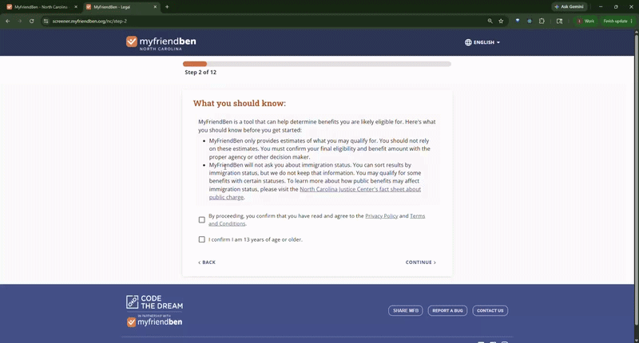

<h1 align="center">Hi, I'm Iryna Kolhanova 👋</h1>

  Software Engineer with experience in backend development, SQL systems, internal enterprise applications, and full-stack web development.

  
   
  

  

---

## About Me

<ul>
  <li>Software Engineer focused on backend systems, SQL development, and enterprise data processing.</li>
  <li>Working with large-scale datasets, ETL workflows, SSIS packages, and internal business applications used for operational and analytical processes. Experienced in building and maintaining backend services, database logic, and data-driven applications within enterprise environments.</li>
  <li>Tech stack includes SQL, TypeScript, Angular, React, .NET, Node.js, Python, and Django.</li>
  <li>Designed to support complex eligibility calculations and structured user input workflows.</li>
</ul>

---

## Tech Stack

  

---

## Featured Project

### MyFriendBen

Benefit eligibility platform built with Python, Django, React, and TypeScript.

The application helps users identify public assistance and support programs they may qualify for based on household information, income, expenses, family size, and current benefits.

Focused on:
- eligibility calculation logic
- data-driven workflows
- complex form handling
- business rule processing
- frontend and backend integration

**Tech Stack:**  
Python • Django • React • TypeScript • SQL

---

### Demo

<!-- Add demo video or GIF here -->

  

---

### Live Application

[MyFriendBen](https://screener.myfriendben.org/step-1)
[For North Carolina](https://bennc.org/)

---

## GitHub Stats

  
  

  

---

## Current Focus

- Enterprise application development
- SQL and ETL/data processing workflows
- Internal business platforms and backend systems
- Full-stack support with Angular, React, and .NET
- AI tools for development productivity

---

## Connect With Me

- LinkedIn: https://www.linkedin.com/in/iryna-kolh/
- GitHub: https://github.com/IrynaKolh
